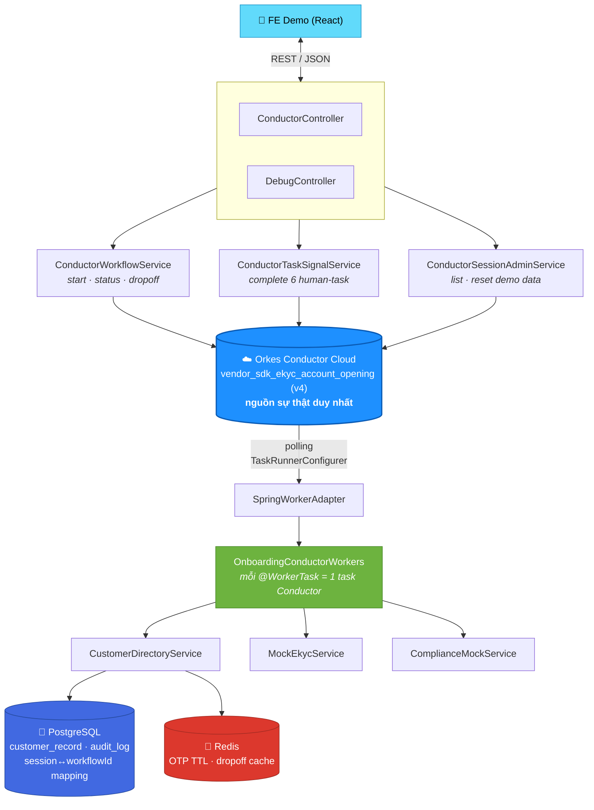

<div align="center">


# VietBank eKYC Onboarding

### ⚡ Mở tài khoản NTB qua SDK vendor — chạy trên **Orkes Conductor Cloud thật**

<p>
Spring Boot đóng vai trò <b>cầu nối worker + REST gateway</b>; toàn bộ state, retry-loop,<br/>
switch/fork/join của luồng nghiệp vụ do <b>Conductor engine</b> điều phối

<br/>

<p>
  
  
  
</p>
<p>
  
  
  
  
  
</p>

<br/>

<a href="#-chạy-thử"><b>🚀 Quick Start</b></a> ·
<a href="#-kiến-trúc"><b>🏗️ Kiến trúc</b></a> ·
<a href="#-thứ-tự-gọi-api"><b>📡 API</b></a> ·
<a href="#-cheat-sheet-test-nhanh"><b>🧪 Test nhanh</b></a> ·
<a href="#️-lưu-ý-trước-khi-lên-môi-trường-thật"><b>⚠️ Go-live checklist</b></a>

</div>

<br/>

---

## 📱 Xem trước

FE demo (`ekyc-onboarding-demo.jsx`) là **1 khung điện thoại giả lập** + **QA Console** (drawer bên phải) — gọi thẳng vào REST API thật, không mock ở tầng UI.

<div align="center">

| | |
|:---:|:---|
| 🎭 | **Ép FAIL từng bước** — OCR / Liveness / NFC → test retry loop + hết lượt thử |
| ⚖️ | **Ép compliance** — SUCCESS / NEED_REVIEW / FAILED không cần đoán SĐT |
| 👁️ | **Xem OTP trực tiếp** — debug endpoint thay vì cắm SMS gateway thật |
| 🚪 | **Giả lập dropoff** — thoát app giữa chừng → resume đúng bước khi mở lại cùng SĐT |
| ⚠️ | **Phát hiện worker stall** — cảnh báo nếu 1 task hệ thống đứng bất thường lâu |
| 🗑️ | **Reset toàn bộ** — xoá sạch dữ liệu demo, test lại từ đầu |

</div>

---

## 💡 Vì sao project này khác các bản POC thông thường?

> Nhiều prototype eKYC chọn **tự code 1 state machine giả lập Conductor**. Bản này thì **không**.

**Orkes Conductor Cloud** là nguồn sự thật duy nhất cho trạng thái luồng. Backend chỉ làm 3 việc:

```
1️⃣  Đồng bộ metadata (task defs + workflow def) lên Orkes lúc khởi động
2️⃣  Chạy worker thật polling task từ Conductor, thực thi business logic (mock vendor OCR/Liveness/NFC/compliance)
3️⃣  Expose REST mỏng cho FE: start / status / dropoff / complete-task
```

Mọi quyết định rẽ nhánh nằm trong **JSON workflow**, không nằm trong `if/else` Java. → Khi cắm vendor thật, **chỉ cần đổi logic bên trong từng `@WorkerTask`** — cấu trúc luồng (Phase, retry, switch, fork/join) giữ nguyên 100%.

---

## 🏗️ Kiến trúc



<table>
<tr><td width="18"><b>🐘</b></td><td><b>PostgreSQL</b> — chỉ còn vai trò <i>mapping mỏng</i> <code>phone ↔ workflowId</code> (<code>OnboardingSession</code>), audit log, bảng KH ETB mock. <b>Không</b> lưu phase/retry-count — những thứ đó nằm trong Orkes workflow instance.</td></tr>
<tr><td><b>🔴</b></td><td><b>Redis</b> — dữ liệu sống ngắn: OTP tự hết hạn theo TTL (<code>OtpService</code>), cache dropoff-by-phone (<code>CustomerDirectoryService</code>).</td></tr>
<tr><td><b>🤝</b></td><td><b>6 human-interaction task</b> (<code>perform_ocr_cccd</code>, <code>perform_liveness</code>, <code>perform_nfc</code>, <code>verify_otp</code>, <code>show_identity_confirmation</code>, <code>show_tnc_screen</code>) dùng <code>asyncComplete=true</code> — worker chỉ "pickup" task, FE gọi <code>POST /api/conductor/{workflowId}/tasks/{taskRef}/complete</code> khi KH thao tác xong, <code>ConductorTaskSignalService</code> sẽ <code>TaskClient.updateTask()</code> để Conductor đi tiếp.</td></tr>
</table>

---

## 🔀 Từ workflow gốc → prototype: rút gọn những gì?

| Phase gốc | Rút gọn trong bản này | Vì sao |
|---|---|---|
| **Phase 0** — OAuth client-credential lấy AccessToken vendor | Sinh `accessToken` nội bộ (UUID) trong `get_vendor_access_token` worker | SDK là **chính chủ bank**, không có OAuth ngoài |
| **Phase 2** — nhánh ETB `handle_etb_customer` | `TERMINATE` với status `COMPLETED` + reason `ETB_REDIRECT` | Không mô phỏng app ETB trong scope |
| **Phase 3/4/5** — vendor OCR/Liveness/NFC thật | `MockEkycService`: luôn `PASS` trừ khi `forceFail=true` từ QA Console | Hiểu luồng nghiệp vụ, không tích hợp vendor thật |
| **Phase 6c** — SMS gateway | OTP 6 số sinh bằng `SecureRandom`, lưu Redis TTL, có `/api/onboarding/debug/otp` | Dễ debug, không cắm SMS gateway thật |
| **Phase 7** — `process_account_in_conductor` | `ComplianceMockService`: rule theo số cuối SĐT hoặc ép qua `forceComplianceResult` | Demo đủ 3 nhánh `SUCCESS` / `NEED_REVIEW` / `FAILED` |
| `notify_vendor_*`, `send_ott_*` | Chỉ log console (`NotificationMockService`) | Không có webhook/SMS/email gateway thật |

> ✅ **Giữ nguyên 100% tinh thần gốc** trong chính workflow JSON (`vendor_sdk_ekyc_account_opening.json`): thứ tự Phase, `DO_WHILE` retry-loop cho OCR/Liveness/NFC, mọi `TERMINATE` (device không đủ điều kiện, hết retry, OTP sai, dưới 18 tuổi, ETB/unknown), `FORK_JOIN` Phase 7, và routing 3 kết quả compliance.

---

## 🚀 Chạy thử

### 1️⃣ Chuẩn bị Conductor Cloud

```bash
cp .env.example .env
```

```dotenv
CONDUCTOR_SERVER_URL=https://developer.orkescloud.com/api
CONDUCTOR_AUTH_KEY=your-key
CONDUCTOR_AUTH_SECRET=your-secret
CONDUCTOR_WORKER_AUTO_START=true
```

> 💡 Khi `CONDUCTOR_WORKER_AUTO_START=true`, app tự **đăng ký task defs + workflow def** lên Orkes lúc `ApplicationReadyEvent` (`ConductorMetadataSyncRunner`) và **bật polling worker** (`ConductorTaskRunner`). Nếu chưa cấu hình đúng, app vẫn chạy tiếp nhưng workflow sẽ đứng yên chờ worker.

### 2️⃣ Chạy hạ tầng + app

<table>
<tr><th>🧑‍💻 Local dev</th><th>🐳 Full Docker</th></tr>
<tr valign="top">
<td>

```bash
docker compose up -d postgres redis
./mvnw clean compile
./mvnw spring-boot:run
```

</td>
<td>

```bash
docker compose up -d --build
```

</td>
</tr>
</table>

> 🌐 Backend chạy ở `http://localhost:8080`. FE demo được serve luôn tại `/` (Babel Standalone transpile JSX ngay trên browser, không cần bundler) — mở là chơi được, không cần chỉnh `baseUrl` nếu chạy cùng origin.

---

## 📡 Thứ tự gọi API

```http
POST /api/conductor/start                                  # Bắt đầu workflow -> workflowId
GET  /api/conductor/{workflowId}                            # Trạng thái hiện tại (FE polling mỗi 2s)
POST /api/conductor/{workflowId}/dropoff                     # KH thoát app giữa chừng
POST /api/conductor/{workflowId}/tasks/{taskRef}/complete    # FE báo hoàn tất 1 trong 6 human-task

GET  /api/onboarding/debug/otp?phone={phone}                 # (dev) xem OTP vừa gửi
GET  /api/onboarding/debug/sessions                           # (dev) 20 session gần nhất
POST /api/onboarding/debug/reset                               # (dev) xoá sạch dữ liệu demo
```

<details>
<summary><b>🔑 6 <code>taskRef</code> cần FE gọi complete thủ công</b> (khớp <code>WorkflowStatusMapper.HUMAN_TASK_REFS</code>)</summary>

```
loop_perform_ocr_ref
loop_perform_liveness_ref
loop_perform_nfc_ref
show_identity_confirmation_ref
show_tnc_screen_ref
verify_otp_ref
```

</details>

---

## 🧪 Cheat-sheet test nhanh

| 🎯 Muốn test gì | 🛠️ Làm sao |
|---|---|
| Nhánh khách hàng hiện hữu (ETB) | Nhập SĐT `0901111111` hoặc `0902222222` |
| Retry & hết lượt thử (OCR/Liveness/NFC) | Bật "Ép FAIL" trong QA Console, thử liên tiếp vượt quá `maxRetries` (mặc định `3`) |
| Dropoff / resume đúng bước cũ | Bấm "Giả lập thoát app" → mở phiên mới **cùng SĐT** |
| Compliance `NEED_REVIEW` | SĐT kết thúc bằng `8` / `9`, hoặc ép trực tiếp trong QA Console |
| Compliance `FAILED` | SĐT kết thúc bằng `0`, hoặc ép trực tiếp trong QA Console |
| Dưới 18 tuổi | Sửa `dob` trong mock CCCD (`MockEkycService.mockCccdData`) |
| Worker BE không poll được task | Theo dõi banner "task đứng lâu" trên FE, kiểm tra log `"Conductor worker polling STARTED"` |
| Reset toàn bộ demo | Nút "Xoá toàn bộ dữ liệu demo" trong QA Console |

---

## ⚙️ Cấu hình đáng chú ý

<sup>`application.yaml`</sup>

```yaml
app.onboarding.retry.default-max-ocr-retries        # số lần retry OCR mặc định
app.onboarding.retry.default-max-liveness-retries    # số lần retry liveness mặc định
app.onboarding.retry.default-max-nfc-retries          # số lần retry NFC mặc định
app.onboarding.otp.debug-endpoint-enabled             # BẬT/TẮT endpoint xem OTP debug
app.onboarding.compliance-mock.strategy                # RULE_BASED | RANDOM
conductor.worker.auto-start                            # bật/tắt sync metadata + polling worker
```

> ⚠️ **Bẫy quan trọng:** đây chính là 3 property `retry.*` mà nếu **không được set trong `application.yaml`**, Spring Boot constructor-binding sẽ để nguyên `OnboardingProperties.retry()` = `null` (namespace không xuất hiện thì không tạo object, kể cả có `@DefaultValue`) → gây `NullPointerException` khi gọi `/api/conductor/start`. **Luôn khai báo tường minh** dù dùng giá trị mặc định.

---

## 🗺️ Roadmap lên môi trường thật

- [ ] Cắm vendor thật cho OCR/Liveness/NFC/C06, gateway SMS thật cho OTP
- [ ] Áp dụng đúng idempotency pattern cho các task ghi dữ liệu non-idempotent (`create_ebank_user`, `create_link_id`) — đã có `idempotencyKey` trong workflow JSON, cần vendor-side dedupe
- [ ] Bật security cho `DebugController` hoặc gỡ hẳn trước khi lên môi trường có dữ liệu thật
- [ ] Siết `CorsConfig` về domain cụ thể của app vendor

## ⚠️ Lưu ý trước khi lên môi trường thật

> [!WARNING]
> - `app.onboarding.otp.debug-endpoint-enabled=true` **chỉ bật ở dev/local** — tắt trước khi deploy.
> - `CorsConfig` đang mở `allowedOriginPatterns("*")` cho tiện demo — siết lại domain cụ thể.
> - `task_definitions.json`: `create_ebank_user`, `create_link_id`, `send_otp` có `retryCount: 0` — **cố ý** vì các task này non-idempotent hoặc tốn phí SMS, không nên để Conductor tự retry.

---

<div align="center">

Made with ☕ & 🏦 for the eKYC onboarding team

<sub>Powered by Spring Boot · Orkes Conductor · PostgreSQL · Redis</sub>

</div>