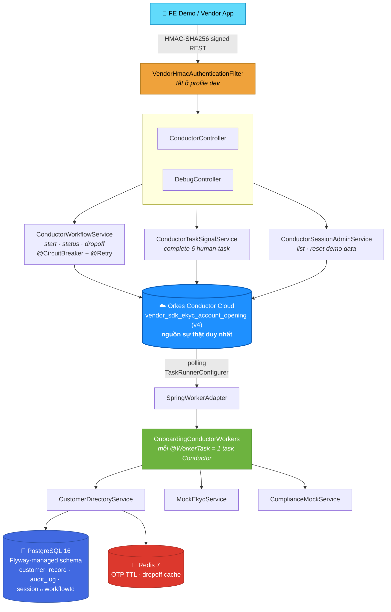

<div align="center">


# VietBank eKYC Onboarding

### ⚡ Mở tài khoản NTB qua SDK vendor — chạy trên **Orkes Conductor Cloud thật**

<p>
Spring Boot đóng vai trò <b>cầu nối worker + REST gateway có bảo mật HMAC</b>; toàn bộ state, retry-loop,<br/>
switch/fork/join của luồng nghiệp vụ do <b>Conductor engine</b> điều phối

<br/>

<p>
  
  
  
</p>
<p>
  
  
  
  
  
  
  
</p>

<br/>

<a href="#-chạy-thử-từ-a-z"><b>🚀 Quick Start A→Z</b></a> ·
<a href="#-kiến-trúc"><b>🏗️ Kiến trúc</b></a> ·
<a href="#-bảo-mật-vendor-hmac"><b>🔐 HMAC Auth</b></a> ·
<a href="#-thứ-tự-gọi-api"><b>📡 API</b></a> ·
<a href="#-cheat-sheet-test-nhanh"><b>🧪 Test nhanh</b></a> ·
<a href="#️-lưu-ý-trước-khi-lên-môi-trường-thật"><b>⚠️ Go-live checklist</b></a>

</div>

<br/>

---

## 📱 Xem trước

FE demo (`ekyc-onboarding-demo.jsx`) là **1 khung điện thoại giả lập** + **QA Console** (drawer bên phải) — gọi thẳng vào REST API thật, không mock ở tầng UI. (Chạy ở profile `dev` nên **không cần ký HMAC** — xem phần bảo mật bên dưới.)

<div align="center">

| | |
|:---:|:---|
| 🎭 | **Ép FAIL từng bước** — OCR / Liveness / NFC → test retry loop + hết lượt thử |
| ⚖️ | **Ép compliance** — SUCCESS / NEED_REVIEW / FAILED không cần đoán SĐT |
| 👁️ | **Xem OTP trực tiếp** — debug endpoint thay vì cắm SMS gateway thật |
| 🚪 | **Giả lập dropoff** — thoát app giữa chừng → resume đúng bước khi mở lại cùng SĐT |
| ⚠️ | **Phát hiện worker stall** — cảnh báo nếu 1 task hệ thống đứng bất thường lâu |
| 🗑️ | **Reset toàn bộ** — xoá sạch dữ liệu demo (kể cả terminate workflow trên Orkes Cloud) |

</div>

---

## 💡 Vì sao project này khác các bản POC thông thường?

> Nhiều prototype eKYC chọn **tự code 1 state machine giả lập Conductor**. Bản này thì **không**.

**Orkes Conductor Cloud** là nguồn sự thật duy nhất cho trạng thái luồng. Backend chỉ làm 3 việc:

```
1️⃣  Đồng bộ metadata (task defs + workflow def) lên Orkes lúc khởi động
2️⃣  Chạy worker thật polling task từ Conductor, thực thi business logic (mock vendor OCR/Liveness/NFC/compliance)
3️⃣  Expose REST mỏng, có bảo mật HMAC, cho FE/vendor: start / status / dropoff / complete-task
```

Mọi quyết định rẽ nhánh nằm trong **JSON workflow**, không nằm trong `if/else` Java. → Khi cắm vendor thật, **chỉ cần đổi logic bên trong từng `@WorkerTask`** — cấu trúc luồng (Phase, retry, switch, fork/join) giữ nguyên 100%.

---

## 🏗️ Kiến trúc



<table>
<tr><td width="18"><b>🔐</b></td><td><b>HMAC-SHA256 auth</b> trên toàn bộ <code>/api/conductor/**</code> — bật ở prod, <b>tắt ở dev</b> vì FE demo chạy browser không thể giữ secret an toàn. Xem chi tiết bên dưới.</td></tr>
<tr><td><b>🐘</b></td><td><b>PostgreSQL</b> — schema quản lý bằng <b>Flyway</b> (<code>V1__init_schema.sql</code>), chỉ còn vai trò <i>mapping mỏng</i> <code>phone ↔ workflowId</code>, audit log, bảng KH ETB mock. <b>Không</b> lưu phase/retry-count.</td></tr>
<tr><td><b>🔴</b></td><td><b>Redis</b> — dữ liệu sống ngắn: OTP tự hết hạn theo TTL, cache dropoff-by-phone.</td></tr>
<tr><td><b>🛡️</b></td><td><b>Resilience4j</b> — circuit breaker + retry bọc quanh mọi lệnh gọi Orkes (<code>start</code>/<code>status</code>/<code>dropoff</code>) trong <code>ConductorWorkflowService</code>, fail nhanh + fallback message rõ ràng thay vì treo request khi Orkes Cloud gián đoạn.</td></tr>
<tr><td><b>🤝</b></td><td><b>6 human-interaction task</b> (<code>perform_ocr_cccd</code>, <code>perform_liveness</code>, <code>perform_nfc</code>, <code>verify_otp</code>, <code>show_identity_confirmation</code>, <code>show_tnc_screen</code>) dùng <code>asyncComplete=true</code> — FE gọi <code>POST /api/conductor/{workflowId}/tasks/{taskRef}/complete</code> khi KH thao tác xong.</td></tr>
</table>

---

## 🔀 Từ workflow gốc → prototype: rút gọn những gì?

| Phase gốc | Rút gọn trong bản này | Vì sao |
|---|---|---|
| **Phase 0** — OAuth client-credential lấy AccessToken vendor | Sinh `accessToken` nội bộ (UUID) trong `get_vendor_access_token` worker | SDK là **chính chủ bank**, không có OAuth ngoài |
| **Phase 2** — nhánh ETB `handle_etb_customer` | `TERMINATE` với status `COMPLETED` + reason `ETB_REDIRECT` | Không mô phỏng app ETB trong scope |
| **Phase 3/4/5** — vendor OCR/Liveness/NFC thật | `MockEkycService`: luôn `PASS` trừ khi `forceFail=true` từ QA Console | Hiểu luồng nghiệp vụ, không tích hợp vendor thật |
| **Phase 6c** — SMS gateway | OTP 6 số sinh bằng `SecureRandom`, lưu Redis TTL, có `/api/onboarding/debug/otp` | Dễ debug, không cắm SMS gateway thật |
| **Phase 7** — `process_account_in_conductor` | `ComplianceMockService`: rule theo số cuối SĐT hoặc ép qua `forceComplianceResult` | Demo đủ 3 nhánh `SUCCESS` / `NEED_REVIEW` / `FAILED` |
| `notify_vendor_*`, `send_ott_*` | Chỉ log console (`NotificationMockService`) | Không có webhook/SMS/email gateway thật |
| Vendor gateway auth thật (mTLS/OAuth) | **HMAC-SHA256** đơn giản, có chống replay ±300s | Đủ minh hoạ nguyên lý xác thực server-to-server, không kéo thêm hạ tầng |

> ✅ **Giữ nguyên 100% tinh thần gốc** trong chính workflow JSON (`vendor_sdk_ekyc_account_opening.json`): thứ tự Phase, `DO_WHILE` retry-loop cho OCR/Liveness/NFC, mọi `TERMINATE`, `FORK_JOIN` Phase 7, và routing 3 kết quả compliance.

---

## 🚀 Chạy thử từ A→Z

### Bước 0 — Yêu cầu môi trường

| Cần gì | Version tối thiểu | Check nhanh |
|---|---|---|
| Java | 21 | `java -version` |
| Docker + Docker Compose | bất kỳ bản còn support | `docker compose version` |
| Tài khoản Orkes Conductor Cloud | Free/Developer tier | https://developer.orkescloud.com |
| (tuỳ chọn) `jq`, `curl` | để test API qua terminal | `jq --version` |

> Không cần cài Maven — repo có sẵn `./mvnw` (Maven Wrapper), tự tải Maven 3.9.16 lần chạy đầu.

### Bước 1 — Lấy key Orkes Conductor Cloud

1. Đăng ký/đăng nhập https://developer.orkescloud.com
2. Vào **Access Control → Application** → tạo Application mới → generate **Access Key + Secret**
3. Gán quyền đủ để tạo/đọc `Workflow Definition`, `Task Definition`, start/execute workflow

### Bước 2 — Clone & cấu hình `.env`

```bash
git clone <repo-url> vietbank-ekyc-onboarding
cd vietbank-ekyc-onboarding
cp .env.example .env
```

Sửa `.env`:

```dotenv
CONDUCTOR_SERVER_URL=https://developer.orkescloud.com/api
CONDUCTOR_AUTH_KEY=your-key
CONDUCTOR_AUTH_SECRET=your-secret
CONDUCTOR_WORKER_AUTO_START=true
SPRING_PROFILES_ACTIVE=dev
ALLOWED_ORIGINS=*
```

> 💡 Khi `CONDUCTOR_WORKER_AUTO_START=true`, app tự **đăng ký task defs + workflow def** lên Orkes lúc `ApplicationReadyEvent` (`ConductorMetadataSyncRunner`) và **bật polling worker** (`ConductorTaskRunner`). Nếu chưa cấu hình đúng, app vẫn chạy tiếp nhưng workflow sẽ đứng yên chờ worker.

### Bước 3 — Chạy hạ tầng + app

<table>
<tr><th>🧑‍💻 Local dev (khuyên dùng khi code/debug)</th><th>🐳 Full Docker (khuyên dùng khi demo nhanh)</th></tr>
<tr valign="top">
<td>

```bash
# Postgres + Redis trong container, app chạy trực tiếp trên máy
docker compose up -d postgres redis

# Local dev thì DB_HOST/REDIS_HOST phải trỏ localhost,
# không phải service-name docker (postgres/redis)
export DB_HOST=localhost REDIS_HOST=localhost

./mvnw clean compile
./mvnw spring-boot:run
```

</td>
<td>

```bash
docker compose up -d --build

# theo dõi log tới khi thấy dòng:
# "Conductor worker polling STARTED"
docker compose logs -f app
```

</td>
</tr>
</table>

> 🌐 Backend chạy ở `http://localhost:8080`. FE demo được serve luôn tại `/` (Babel Standalone transpile JSX ngay trên browser, không cần bundler) — mở là chơi được.

### Bước 4 — Kiểm tra app đã sống chưa

```bash
curl -s http://localhost:8080/actuator/health | jq
# {"status":"UP", ...}
```

Swagger UI (chỉ bật ở dev): mở trình duyệt tới **http://localhost:8080/docs**

### Bước 5 — Test luồng end-to-end qua trình duyệt (nhanh nhất)

1. Mở `http://localhost:8080`
2. Bấm **"Mở tài khoản ngay"**
3. Ở mỗi bước OCR/Liveness/NFC/Identity/TnC/OTP — bấm nút hành động tương ứng trên giao diện
4. Bấm **"Xem OTP (debug)"** trong QA Console để lấy mã OTP thay vì chờ SMS
5. Xem kết quả cuối (`SUCCESS` / `NEED_REVIEW` / `FAILED`) tuỳ số điện thoại nhập (xem bảng cheat-sheet bên dưới)

### Bước 6 — Test qua `curl` (cho ai muốn tự động hoá / hiểu rõ payload)

```bash
BASE=http://localhost:8080

# 1) Start workflow — dev profile: security.enabled=false nên KHÔNG cần ký HMAC
WF_ID=$(curl -s -X POST $BASE/api/conductor/start \
  -H "Content-Type: application/json" \
  -d '{
    "vendorClientId": "demo-client-id",
    "vendorClientSecret": "demo-client-secret",
    "sdkSessionId": "SDK-TEST01",
    "productType": "TKTT_DEBIT",
    "deviceInfo": {"model":"Pixel 8 Pro","osVersion":"Android 15","nfcSupported":true},
    "phone": "0909123456",
    "vendorId": "VENDOR_BANK_APP"
  }' | jq -r '.workflowId')

echo "workflowId=$WF_ID"

# 2) Poll status
curl -s $BASE/api/conductor/$WF_ID | jq

# 3) Complete OCR (asyncComplete task) khi currentTaskRef == loop_perform_ocr_ref
curl -s -X POST $BASE/api/conductor/$WF_ID/tasks/loop_perform_ocr_ref/complete \
  -H "Content-Type: application/json" -d '{"forceFail": false}'

# ... lặp lại tương tự cho loop_perform_liveness_ref, loop_perform_nfc_ref,
#     show_identity_confirmation_ref, show_tnc_screen_ref

# 4) Xem OTP debug rồi verify
OTP=$(curl -s "$BASE/api/onboarding/debug/otp?phone=0909123456" | jq -r '.otp')
curl -s -X POST $BASE/api/conductor/$WF_ID/tasks/verify_otp_ref/complete \
  -H "Content-Type: application/json" -d "{\"forceFail\": false, \"outputData\": {\"otp\": \"$OTP\"}}"

# 5) Xem kết quả cuối
curl -s $BASE/api/conductor/$WF_ID | jq '.output'
```

---

## 🔐 Bảo mật Vendor (HMAC)

`/api/conductor/**` được bảo vệ bằng **HMAC-SHA256**, chống replay ±300s (`VendorHmacAuthenticationFilter`). **Mặc định TẮT ở profile `dev`** (`app.onboarding.security.enabled=false`) vì FE demo chạy thẳng trên browser không có chỗ nào giữ secret an toàn — đây là quyết định có chủ đích, **không phải bug**.

Khi bật (`prod` hoặc set `VENDOR_AUTH_ENABLED=true`), mọi request cần 3 header:

| Header | Giá trị |
|---|---|
| `X-Vendor-Id` | ID vendor, khớp key trong `app.onboarding.vendors.*` (vd `VENDOR_BANK_APP`) |
| `X-Timestamp` | epoch giây hiện tại |
| `X-Signature` | `hex(HMAC_SHA256(secret, vendorId + "." + timestamp + "." + rawBody))` |

<details>
<summary><b>🧪 Script Bash ký request mẫu</b> (test HMAC thủ công không cần code thêm)</summary>

```bash
#!/usr/bin/env bash
VENDOR_ID="VENDOR_BANK_APP"
SECRET="demo-secret"            # trùng VENDOR_BANK_APP_SECRET trong .env
TS=$(date +%s)
BODY='{"vendorClientId":"demo-client-id","vendorClientSecret":"demo-client-secret","sdkSessionId":"SDK-HMAC01","productType":"TKTT_DEBIT","deviceInfo":{"model":"Pixel 8","osVersion":"Android 15","nfcSupported":true},"phone":"0909123456","vendorId":"VENDOR_BANK_APP"}'

SIG=$(printf '%s' "${VENDOR_ID}.${TS}.${BODY}" | openssl dgst -sha256 -hmac "$SECRET" | sed 's/^.* //')

curl -s -X POST http://localhost:8080/api/conductor/start \
  -H "Content-Type: application/json" \
  -H "X-Vendor-Id: $VENDOR_ID" \
  -H "X-Timestamp: $TS" \
  -H "X-Signature: $SIG" \
  -d "$BODY" | jq
```

</details>

Vendor + secret cấu hình trong `application.yaml`:

```yaml
app:
  onboarding:
    security:
      enabled: ${VENDOR_AUTH_ENABLED:true}
    vendors:
      VENDOR_BANK_APP:
        api-key: ${VENDOR_BANK_APP_API_KEY:demo-api-key}
        secret: ${VENDOR_BANK_APP_SECRET:demo-secret}
```

Endpoint `/api/onboarding/debug/**` **luôn miễn HMAC** (tự guard riêng bằng `debug-endpoint-enabled`) vì bản chất đã chỉ dành cho dev/QA.

---

## 📡 Thứ tự gọi API

```http
POST /api/conductor/start                                  # Bắt đầu workflow -> workflowId
GET  /api/conductor/{workflowId}                            # Trạng thái hiện tại (FE polling mỗi 2s)
POST /api/conductor/{workflowId}/dropoff                     # KH thoát app giữa chừng
POST /api/conductor/{workflowId}/tasks/{taskRef}/complete    # FE báo hoàn tất 1 trong 6 human-task
GET  /api/conductor/meta                                     # Danh sách 6 human-task ref (FE fetch, không hardcode)

GET  /api/onboarding/debug/otp?phone={phone}                 # (dev) xem OTP vừa gửi
GET  /api/onboarding/debug/sessions                           # (dev) 20 session gần nhất
POST /api/onboarding/debug/reset                               # (dev) xoá sạch dữ liệu demo + terminate workflow Orkes

GET  /docs                                                     # Swagger UI (chỉ dev)
GET  /v3/api-docs                                              # OpenAPI spec JSON
GET  /actuator/health                                           # Health check (health + info exposed)
```

<details>
<summary><b>🔑 6 <code>taskRef</code> cần FE gọi complete thủ công</b> (khớp <code>HumanTaskRefs.REFS</code>, cũng fetch được qua <code>GET /api/conductor/meta</code>)</summary>

```
loop_perform_ocr_ref
loop_perform_liveness_ref
loop_perform_nfc_ref
show_identity_confirmation_ref
show_tnc_screen_ref
verify_otp_ref
```

</details>

<details>
<summary><b>❌ Format lỗi</b> — RFC 7807 <code>ProblemDetail</code>, không còn DTO tự chế</summary>

```json
{
  "type": "https://api.vietbank.example/errors/invalid-phase",
  "title": "INVALID_PHASE",
  "status": 409,
  "detail": "Task 'verify_otp_ref' hiện không ở trạng thái SCHEDULED/IN_PROGRESS...",
  "properties": {
    "code": "INVALID_PHASE",
    "timestamp": "2026-08-30T10:15:00Z"
  }
}
```

</details>

---

## 🧪 Cheat-sheet test nhanh

| 🎯 Muốn test gì | 🛠️ Làm sao |
|---|---|
| Nhánh khách hàng hiện hữu (ETB) | Nhập SĐT `0901111111` hoặc `0902222222` |
| Retry & hết lượt thử (OCR/Liveness/NFC) | Bật "Ép FAIL" trong QA Console, thử liên tiếp vượt quá `maxRetries` (mặc định `3`) |
| Dropoff / resume đúng bước cũ | Bấm "Giả lập thoát app" → mở phiên mới **cùng SĐT** |
| Compliance `NEED_REVIEW` | SĐT kết thúc bằng `8` / `9`, hoặc ép trực tiếp trong QA Console |
| Compliance `FAILED` | SĐT kết thúc bằng `0`, hoặc ép trực tiếp trong QA Console |
| Dưới 18 tuổi | Sửa `dob` trong mock CCCD (`MockEkycService.mockCccdData`) |
| Worker BE không poll được task | Theo dõi banner "task đứng lâu" trên FE, kiểm tra log `"Conductor worker polling STARTED"` |
| Orkes Cloud gián đoạn tạm thời | Circuit breaker `orkes` sẽ retry 3 lần rồi fallback trả `INVALID_PHASE` thay vì treo request — xem log `ConductorWorkflowService` |
| HMAC auth reject sai chữ ký | Set `VENDOR_AUTH_ENABLED=true`, gọi API không header → 401 `"Thiếu header xác thực vendor"` |
| Reset toàn bộ demo | Nút "Xoá toàn bộ dữ liệu demo" trong QA Console, hoặc `POST /api/onboarding/debug/reset` |

---

## ⚙️ Cấu hình đáng chú ý

<sup>`application.yaml`</sup>

```yaml
app.onboarding.retry.default-max-ocr-retries        # số lần retry OCR mặc định
app.onboarding.retry.default-max-liveness-retries    # số lần retry liveness mặc định
app.onboarding.retry.default-max-nfc-retries          # số lần retry NFC mặc định
app.onboarding.otp.debug-endpoint-enabled             # BẬT/TẮT endpoint xem OTP debug
app.onboarding.compliance-mock.strategy                # RULE_BASED | RANDOM
app.onboarding.security.enabled                        # BẬT/TẮT xác thực HMAC (mặc định true, dev override = false)
app.onboarding.vendors.<VENDOR_ID>.secret               # secret HMAC theo từng vendor
conductor.worker.auto-start                            # bật/tắt sync metadata + polling worker
resilience4j.circuitbreaker.instances.orkes              # ngưỡng mở circuit khi gọi Orkes Cloud
resilience4j.retry.instances.orkes                        # số lần retry + delay trước khi circuit breaker can thiệp
```

> ⚠️ **Bẫy quan trọng #1:** 3 property `retry.*` — nếu **không set trong `application.yaml`**, Spring Boot constructor-binding để nguyên `OnboardingProperties.retry()` = `null` (namespace không xuất hiện thì không tạo object, kể cả có `@DefaultValue`) → NPE khi gọi `/api/conductor/start`. **Luôn khai báo tường minh** dù dùng giá trị mặc định.

> ⚠️ **Bẫy quan trọng #2:** chạy local (không qua `docker compose up app`) thì phải **export `DB_HOST=localhost REDIS_HOST=localhost`** — mặc định 2 biến này trỏ tới service-name Docker (`postgres`/`redis`), chỉ resolve được bên trong network của Compose.

---

## 🗄️ Schema & Migration (Flyway)

Schema quản lý qua Flyway (`src/main/resources/db/migration/V1__init_schema.sql`), `spring.jpa.hibernate.ddl-auto: validate` — Hibernate **chỉ validate**, không tự sinh/sửa bảng nữa. Muốn thêm cột/bảng mới:

```bash
# Tạo file mới, KHÔNG sửa lại migration cũ đã chạy
touch src/main/resources/db/migration/V2__add_something.sql
```

Flyway tự chạy lúc app khởi động (`baseline-on-migrate: true`).

---

## 🗺️ Roadmap lên môi trường thật

- [ ] Cắm vendor thật cho OCR/Liveness/NFC/C06, gateway SMS thật cho OTP
- [ ] Áp dụng đúng idempotency pattern cho các task ghi dữ liệu non-idempotent (`create_ebank_user`, `create_link_id`) — đã có `idempotencyKey` trong workflow JSON, cần vendor-side dedupe
- [ ] Refactor blocking poll-loop trong `ConductorTaskSignalService.findInProgressTaskWithRetry` → event-driven (webhook/SSE từ Orkes thay vì retry-poll tay)
- [ ] Thay 2s frontend polling bằng WebSocket/SSE
- [ ] Testcontainers cho integration test (Postgres + Redis thật thay vì mock)
- [ ] Micrometer Tracing / OpenTelemetry
- [ ] Structured logging (JSON) cho log aggregation
- [ ] Camera preview thật qua `getUserMedia` (hiện FE chỉ có khung scan giả lập)
- [ ] PWA manifest cho FE demo

<details>
<summary>✅ Đã hoàn thành (không cần làm lại)</summary>

- Spring Security + HMAC-SHA256 xác thực vendor, chống replay
- RFC 7807 `ProblemDetail` cho toàn bộ error response
- Flyway thay `ddl-auto: update`
- Resilience4j circuit breaker + retry quanh mọi lệnh gọi Orkes Conductor
- Spring profile tách dev/prod/base, virtual threads, gzip compression, HikariCP tuning
- Swagger UI (`springdoc-openapi`) — tắt hẳn ở prod
- Bean Validation cho request DTO, `HumanTaskRefs` làm nguồn sự thật chung FE/BE
- Debug endpoints tự guard bằng flag, CORS tắt mặc định (off by default)
- Fix race-condition `SCHEDULED`/`IN_PROGRESS` giữa `WorkflowStatusMapper` và `ConductorTaskSignalService`
- `DebugController.reset()` terminate cả workflow RUNNING trên Orkes Cloud, không chỉ xoá local DB
- FE: dark mode, progress bar animate, copy-to-clipboard, OTP countdown, error banner tự tắt

</details>

## ⚠️ Lưu ý trước khi lên môi trường thật

> [!WARNING]
> - `app.onboarding.otp.debug-endpoint-enabled=true` **chỉ bật ở dev/local** — tắt trước khi deploy.
> - `app.onboarding.security.enabled=false` **chỉ ở dev** — prod phải `true`, và **phải đổi secret mặc định `demo-secret`**.
> - `CorsConfig` ở dev đang mở `allowedOriginPatterns("*")` — profile `prod` **bắt buộc** set `ALLOWED_ORIGINS` cụ thể (fail-fast nếu quên, xem `application-prod.yaml`).
> - `task_definitions.json`: `create_ebank_user`, `create_link_id`, `send_otp` có `retryCount: 0` — **cố ý** vì các task này non-idempotent hoặc tốn phí SMS, không nên để Conductor tự retry.
> - `V1__init_schema.sql` phải được **baseline đúng với schema đang chạy thật** (chạy `ddl-auto: update` lần cuối rồi soi diff) trước khi merge — tránh Flyway drift giữa các môi trường.

---

<div align="center">

Made with ☕ & 🏦 for the eKYC onboarding team

<sub>Powered by Spring Boot · Orkes Conductor · PostgreSQL · Redis · Resilience4j</sub>

</div>